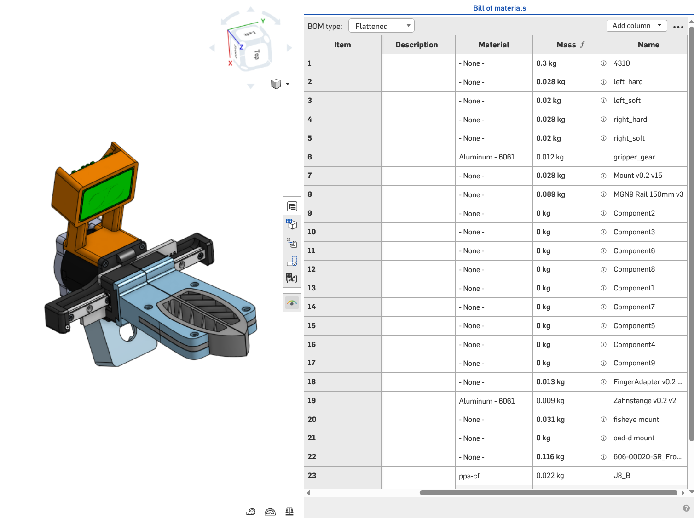

# onshape2xacro

A streamlined exporter for converting Onshape assemblies into high-quality Xacro/URDF robot descriptions.

## Why yet another exporter?

Existing exporters often output flat URDFs or require numerous API calls that can quickly drain out the annual limit. `onshape2xacro` is designed with a different philosophy:

- **Easier to change values in Xacro**: Outputs clean Xacro files instead of flat URDFs. This makes it trivial to tweak joint limits, colors, or physics parameters directly in the code without re-exporting. Also, the generated xacro macro makes it easier to integrate the robot into the project and reduce post-processing need.
- **Saves API calls via Local Processing**: Instead of downloading each part individually via the API, it fetches the entire assembly as a STEP file once. All mesh extraction and inertia calculations are then performed locally using the STEP data, resulting in a much faster and more reliable pipeline.
- **Auto-link Merging**: Automatically identifies and merges parts that are fixed together in Onshape. This produces a clean, simplified kinematic tree that matches how the robot is actually controlled, rather than having a link for every single screw.

## Installation

This project uses `uv` for modern, fast Python package management.

Using `uv` directly:

```bash
# install in your local bin
uv tool install "git+https://github.com/qrafty-ai/onshape2xacro"
# or if you just want to test without installation
uvx --from git+https://github.com/qrafty-ai/onshape2xacro onshape2xacro --help
```

or manually clone the repo:

```bash
git clone https://github.com/qrafty-ai/onshape2xacro.git
cd onshape2xacro
uv sync # or pip install -e .
```

## Usage

The export workflow is broken down into modular steps to give you full control over the process:

0. **Prerequisite**: Before exporting, rename all mates you wish to convert into URDF joints using the prefix joint_. This allows the tool to distinguish between your robot's kinematic joints and other assembly constraints.

1. **Auth**: Setup your Onshape API credentials.

    ```bash
    onshape2xacro auth login
    ```

    Follow the prompts to enter your Access and Secret keys. These are stored securely in your system keyring. You can check the status with `onshape2xacro auth status`.

2. **Fetch CAD**: Download the assembly structure and STEP assets.

    ```bash
    onshape2xacro fetch-cad <assembly_url> <local_dir>
    ```

    This generates:
    - `cad.pickle`: Cached assembly metadata.
    - `assembly.step`: The full 3D geometry of the robot.
    - `configuration.yaml`: A unified configuration file containing export settings, mate values, and link name mappings.

    Note that due to the limitation of Onshape API (see [Limitation](#limitation)) there's no stable enough way to retrieve the current mate values of the assembly automatically. Therefore, the default generated mate values in `configuration.yaml` are all 0. The preferred way is to make sure you put all mates to 0 before fetching data (you can create a [Name Position](https://cad.onshape.com/help/Content/named-positions.htm) to make this easier). If there's mate that can't be set to `0`, you can modify the `mate_values` section in `configuration.yaml` manually to the correct values.

3. **Modify Configuration** (Optional):
    You can customize the export by editing `<local_dir>/configuration.yaml`. This file contains:

    - **`mate_values`**: Joint angles and translations for each mate. Edit these if you want to export the robot in a specific pose (e.g., a "zero" configuration that differs from the CAD model). Set `invert_direction: true` on a mate to flip its joint direction.
    - **`link_names`**: Override auto-generated link names with custom names.
    - **`export`**: Export settings including:
      - `name`: Robot name
      - `visual_option`: Visual mesh formats and size limits
      - `collision_option`: Collision mesh generation method (fast or coacd)
      - `bom`: Path to BOM CSV file
      - `output`: Output directory path

    Example `configuration.yaml`:
    ```yaml
    export:
      name: my_robot
      visual_option:
        formats: [obj]
        max_size_mb: 10.0
      collision_option:
        method: fast
      output: output
    mate_values:
      mate_id_xyz:
        featureId: mate_id_xyz
        mateName: joint_arm
        invert_direction: false
        rotationZ: 1.57  # 90 degrees
        translationX: 0.0
    link_names:
      base_link: custom_base
    ```

4. **Export**: Generate the final Xacro description.

    ```bash
    onshape2xacro export <local_dir> --output <final_xacro_dir>
    ```

    This processes the local assets, calculates inertias based on geometry and material density, extracts visual/collision meshes, and writes the Xacro files. The command reads the `configuration.yaml` file from `<local_dir>` and uses those settings for the export.

    You can also override specific settings from the command line:
    ```bash
    onshape2xacro export <local_dir> --output <final_xacro_dir> --name custom_robot --visual-option.formats obj stl
    ```

5. **BOM Export** (Optional):
    For inertial calculation, you can provide a Bill of Materials (BOM) CSV to specify material densities and mass for different parts. The BOM path can be specified either in `configuration.yaml` under `export.bom` or via command line:

    ```bash
    onshape2xacro export <local_dir> --output <final_xacro_dir> --bom <path_to_bom.csv>
    ```

    You can also copy the BOM file to `<local_dir>/bom.csv`, and it will be automatically detected.

    BOM can be exported from Onshape's assembly page, make sure to include `Name`, `Material`, and `Mass` columns into the bill and make sure their values are presented:
    

    The inertia calculation assumes that the part's mass is uniformly distributed (which is true for metals but not the case for 3D-printed parts).

    To debug the inertial calculation, inspect the generated `inertia_debug.md` file in the output directory and compare with [calculated values](https://cad.onshape.com/help/Content/massprops-asmb.htm?cshid=massprops_assembly) from Onshape.

## Limitation

### Requires zeroing robot pose before export

**Why is manual input required?** To correctly align the URDF joints with the exported STEP geometry, the tool requires the specific values of every mate at the time of export. However, the current Onshape API ([getMateValues](https://cad.onshape.com/glassworks/explorer/#/Assembly/getMateValues)) does not support recursive retrieval and only returns data for the root assembly. Consequently, you must manually specify the mate values in the `mate_values` section of `configuration.yaml` for any joints located inside sub-assemblies to ensure the kinematic chain matches the link meshes.

### Limited type of mates supported

Currently only revolute mates supported, PRs are welcome!

## Acknowledgements

- **[onshape-robotics-toolkit](https://github.com/onshape-robotics/onshape-robotics-toolkit)**: This project directly utilizes the toolkit for CAD communication and kinematic graph construction.
- **[onshape2robot](https://github.com/Rhoban/onshape2robot)**: We take great inspiration from the pioneering work of the `onshape2robot` project.
